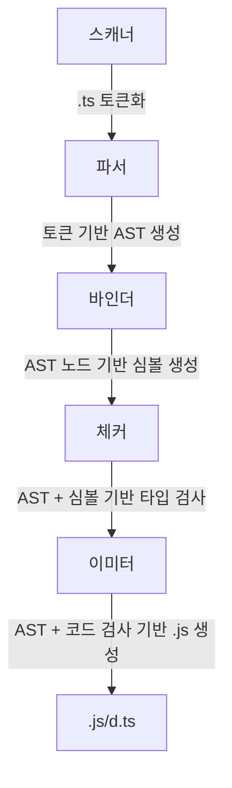

### 타입스크립트 컴파일 과정

1. 타입스크립트 소스코드를 타입스크립트 AST로 만든다.(tsc)
2. 타입 검사기가 AST를 확인하여 타입을 확인한다.(tsc)
3. 타입스크립트 AST를 자바스크립트 소스로 변환한다.(tsc)
4. 자바스크립트 소스코드를 자바스크립트 AST로 만든다.(런타임)
5. AST가 바이트 코드로 변환된다.(런타임)
6. 런타임에서 바이트코드가 평가되어 프로그램이 실행된다.(런타임)

```
❓ AST: 추상 구문 트리

컴파일러가 소스코드를 해석하는 과정에서 생성된 데이터 구조

컴파일러는 어휘적 분석과 구문 분석을 통해 소스코드를 노드 단위의 트리 구조로 구성한다.

https://ts-ast-viewer.com/#code/GYVwdgxgLglg9mABFATgQzAZwBQEoDeAUIiYhApnADYCmAdFXAObYDkaHaruhAvoagw5cQA

```

### 코드 검사기로서의 타입스크립트 컴파일러

타입스크립트 컴파일러는 tsc binder를 사용하여 타입 검사를 한다.

### **코드 변환기로서의 타입스크립트 컴파일러**

타입스크립트 컴파일러는 타입 검사를 수행한 후 코드 변환을 시작하는데, 이때 타입 오류가 있더라도 일단 컴파일을 진행 → 타입스크립트 코드가 자바스크립트 코드로 변환되는 과정은 타입 검사와 독립적으로 동작하기 때문에


### 타입스크립트 컴파일러의 역할

- 최신 버전의 타입스크립트, 자바스크립트 코드를 구버전의 자바스크립트로 트랜스파일한다.
- 코드의 타입 오류를 검사한다.


## 타입스크립트 컴파일러의 구조



1. tsc 명령어를 실행하여 프로그램 객체가 컴파일 과정 시작
2. 스캐너는 소스 파일을 토큰 단위로 분리
3. 파서는 토큰을 이용해 AST 생성
4. 바인더는 AST의 각 노드에 대응하는 심볼을 생성, 심볼은 선언된 타입의 노드 정보를 담고 있음
5. 체커는 AST를 탐색하면서 심볼 정보를 활용하여 타임 검사 수행
6. 타입 검사 결과 에러 없다면 이미터를 사용해서 자바스크립트 소스 파일로 변환
